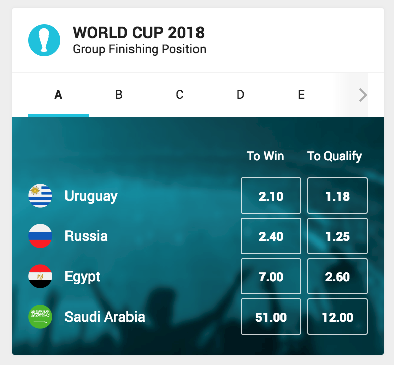

# wc2018-group-winner-widget



A widget displaying each group in the tournament and the bet offers for each participant to win or qualify (e.g finish top 2).

Countries are sorted by lowest odds and the tab show on load contains participants who have the next coming match.

If the next coming match runs in parallell with another match and participants are from two different groups - the group with participant having lowest odds to win will display.

Once a betoffer is unavailable, e.g. a team has already qualified or cannot qualify, the outcomes will disappear from the widget. If a participant doesn't have any betoffers, they will not be shown in the widget.

## Configuration

Arguments and default values:

```json
"args": {
    widgetTrackingName: 'wc2018-group-winner',
    filter: '/football/world_cup_2018',
    iconUrl:
      'https://d1fqgomuxh4f5p.cloudfront.net/tournamentdata/worldcup2018/icons/world_cup_2018_inverted.svg',
    flagUrl:
      'https://d1fqgomuxh4f5p.cloudfront.net/tournamentdata/worldcup2018/icons/',
    backgroundUrl:
      'https://d1fqgomuxh4f5p.cloudfront.net/tournamentdata/worldcup2018/overview-bw-bg-desktop.jpg',
}
```

1.  `widgetTrackingName` - String - name for tracking analytics
2.  `filter` - String - url path to tournament
3.  `iconUrl` - String - url path to tournament icon
4.  `flagUrl` - String - url path to participant flags
5.  `backGroundUrl` - String - url path to backgroundUrl. Option to provide custom background image for widget. Otherwise, default background will be used.

### Build Instructions

Please refer to the [core-library](https://github.com/kambi-sportsbook-widgets/widget-core-library)
